# Git
## 什么是Git?
- Git是一款源代码管理工具(版本控制工具)
  - 我们写的代码需要使用Git进行管理。
- svn,vss,vcs.... git
- 有必要，因为人工的去处理不同的版本，做相应备份会很麻烦。
- Git是linux之父当年为了维护linux---linus之前也是手动维护合并把文件发给Linus
- linus自己写了一个版本管理的工具(Git)
- git官网 [https://git-scm.com](https://git-scm.com/)

## Git安装
阅读协议
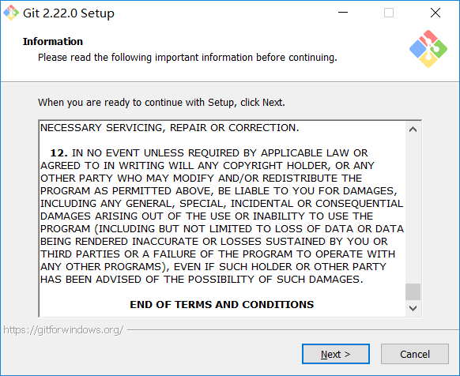
选择安装路径
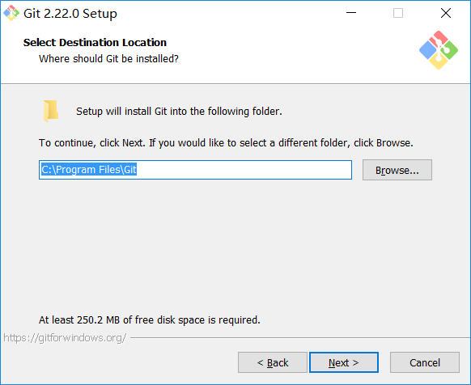
选择附属组件
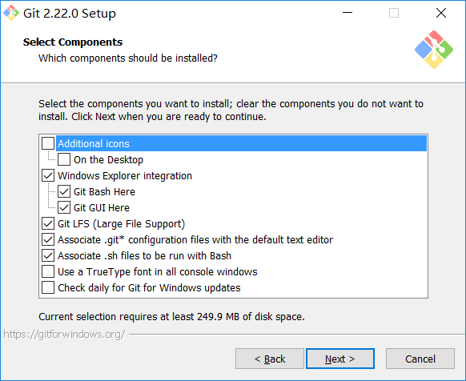
开始菜单中文件夹名称
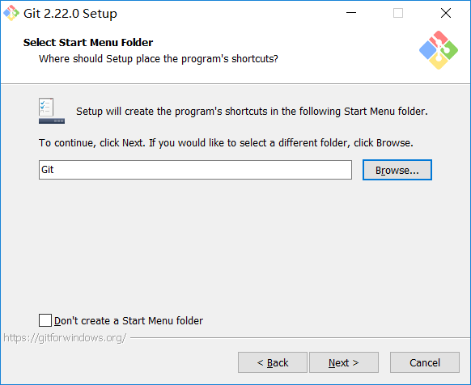
Git使用编辑器选择
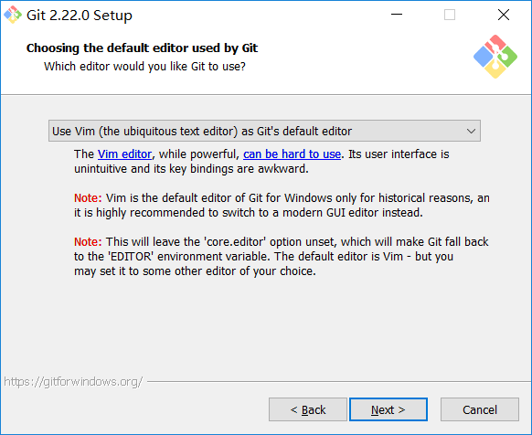
如何使用Git命令行
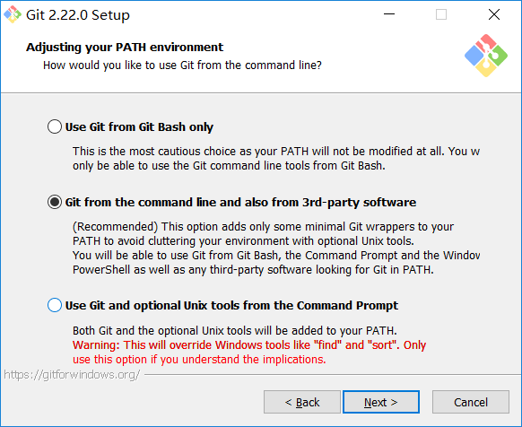
Git库链接方式
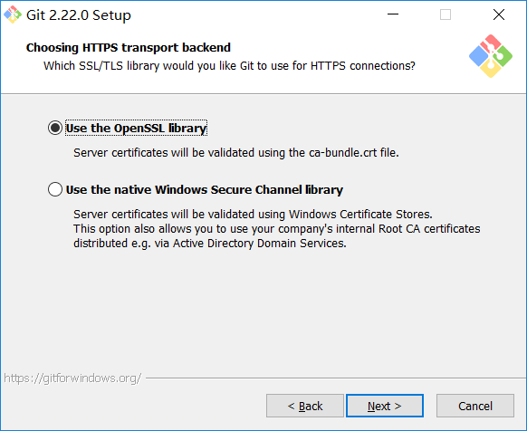
...

## 


## 初次安装 Git 自报家门

- 就是在Git中设置当前使用的用户是谁
	- 每一次备份都会把当前备份者的信息存储起来
- 命令
	- 配置用户名:```git config --global user.name "zxhy"```
	- 配置邮箱：```git config --global user.email "chunfeng@zxyi.cn"```

邮箱格式: xxx@xx.cn / xxx@xx.com

## 初始化仓储/(仓库)

- "git init"：初始化仓库, 一个项目只用初始化一次仓库。

（新建index.html）
- "git status"：查看 git状态,

  - 没跟踪文件，没有提交文件，是一个干净的工作目录。

  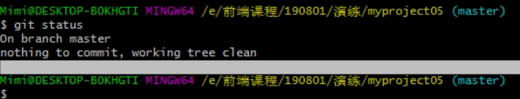

  - 有文件变更, 需要跟踪（需要放到我们的仓库门口）

    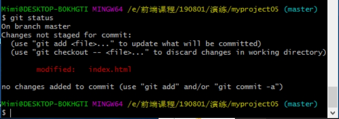
    
  - 是有跟踪文件（在仓库门口）， 需要我们进行文件提交（git commit -m "操作描述"）

    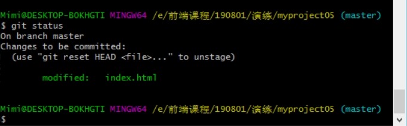

- git add ./index.html：跟踪 文件，（将文件放到仓库门口）

  - "git add ." 表示添加当前目录所有变更文件跟踪起来（所有变更文件放到仓库门口）

  - 错误示范 add 后面的 . 需要空格隔开。

    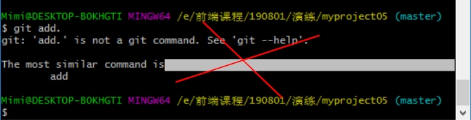

- "git commit -m "初始化的第一个index.html" ":记录文件并描述文件，（将文件放入到仓库中）

-  "git commit --all -m "一次跟踪多个文件并添加到仓库中" "

- git log：查看git提交记录

  查看精简日志： git log --oneline


## 回退操作

- "git reset --hard Head~0": 回退到 最近一次提交的版本。（把修改的且没有跟踪或没有提交的文件回退到 最近一次提交的版本）

- " git reset --hard [版本ID]" :通过 ID 操作进行回退（推荐使用 ID回退）

- 错误示范

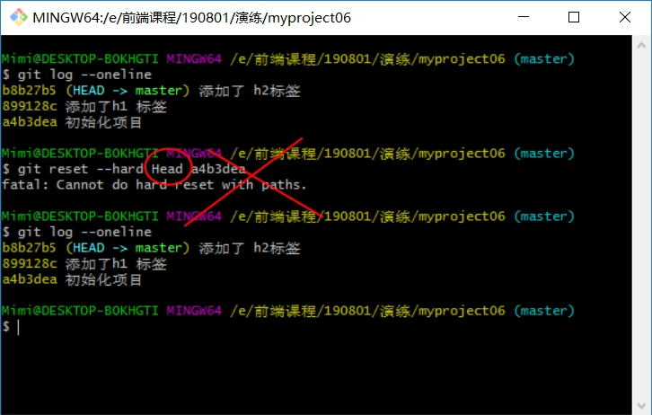

- " git reflog" :查看每一次操作记录

	- 回退到我们想要的版本上面


##  分支

默认是有一个主分支 master


### 创建分支

"git branch" :查看分支， *表示当前分支；

"git branch dev": 创建分支 dev 为分支名称；


### 切换分支

"git checkout dev" ：切换到dev分支

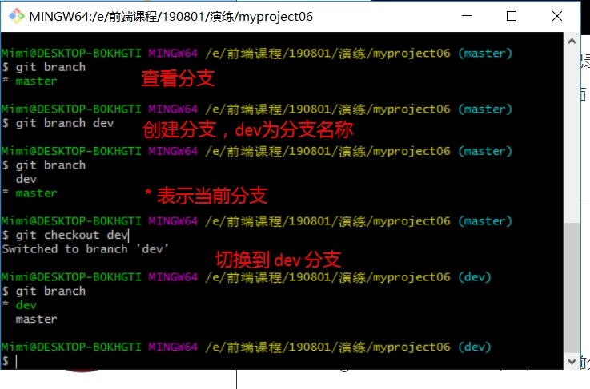

### 合并分支

当dev 分支开发完成， 切换到 master 分支 进行合并

" git merge dev" 合并dev 分支到 master

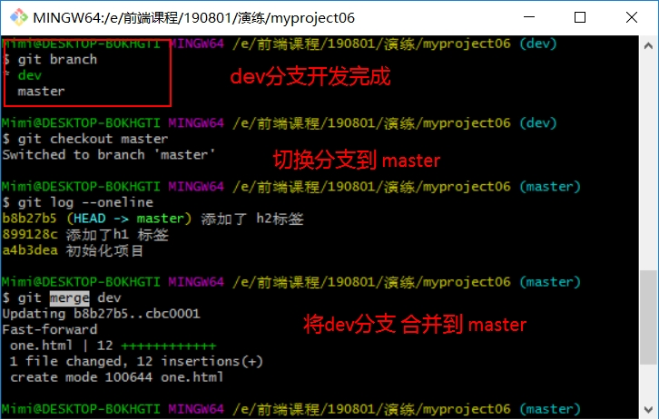


作业：
创建一个 projectDemo 项目
1.提交一个 index.html 文件到仓库

2.在index.html 文件中添加 H1 标签并且提交到仓库

3.在index.html 文件中添加 H2 标签并且提交到仓库

4.回退操作 回退到 "2. 添加 H1 标签" 时的提交

5.回退到 "3. 添加 H2 标签" 时的提交

6.创建 dev 分支， 并切换到 dev分支添加一个 one.html 文件，

7.提交这个 one.html 文件到 仓库

8.将 dev 合并到 master分支


## 终端操作常见命令 拓展

- ls：查看当前目录文件

- ls -al: 查看当前目录详细文件 

- pwd：查看当前所在目录

- touch ：创建一个文件 

### vim 终端编辑器：

- vim 【文件名】进入编辑状态
- 按键输入必须是在 英文输入状态
- 进入编辑状态 后 按 键盘 i 进入编辑模式
- 按 键盘 esc 退出编辑模式

	- 输入英文状态下的 冒号 ":wq" 保存并退出

- 按 键盘 esc 退出编辑模式

	- 输入英文状态下的 冒号 ":q!" 退出不保存 ，感叹号 ！ 表示强制退出

